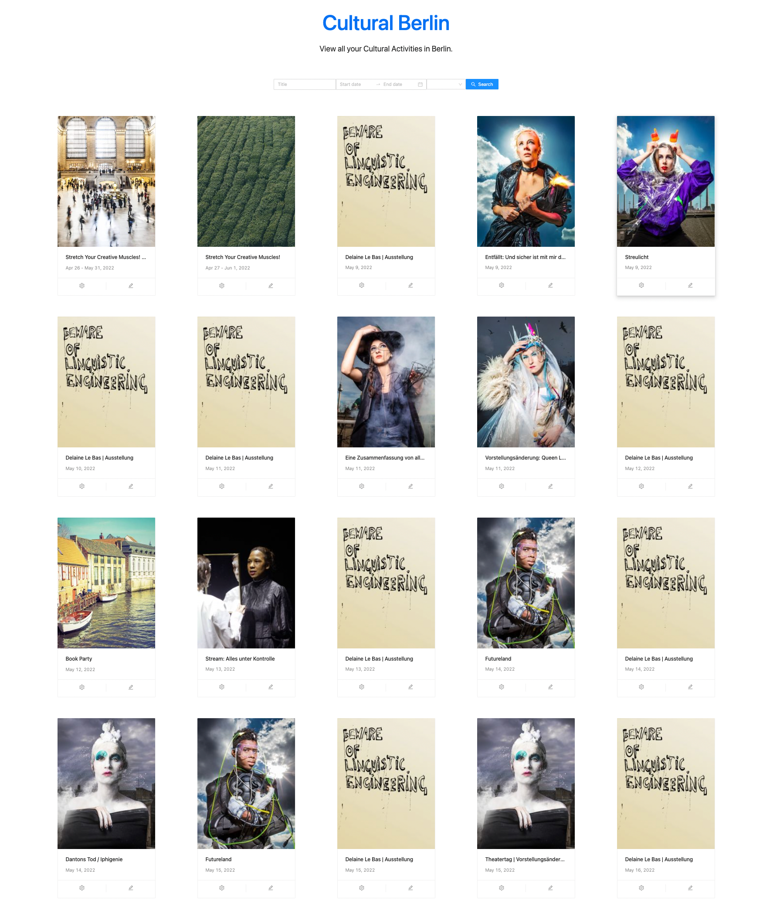

# Cultural-Berlin

A simple app aggregating Cultural activities in Berlin

## Starting the app.

### Starting the API Server (backend)
1. Start up your terminal.
2. Ensure that you've `ruby` installed on your machine.
3. Ensure you have Postgresql database installed on your machine.
4. Ensure you have `redis` installed on your machine. For mac os, run `brew install redis`
5. Start the redis service. For mac os run `brew services start redis`.
6. Clone the repository from `git@github.com:koyagabriel/Cultural-Berlin.git`.
7. Navigate into the `Cultural-Berlin` folder.
8. Navigate into the `cultural-activities-api` directory using `cd cultural-activities-api`.
9. Run `bundle install` to install necessary gems.
    1. We are using `Figaro gem` to manage our environment variables, so we need to do the following to setup our variables.
        - Run `bundle exec figaro install` to create `config/application.yml` file. This is where we  will add our env variables.
        - Add the following variables to `config/application.yml`. Ensure you set their values.
          ```
            db_name: <the name of your database>
            db_password: <database password>
            db_username: <database user>
            db_host: <database host>
            db_port: <database port>
            ```
10. Run the command `rails db:setup` to setup and seed the database.
11. Start the server with `rails s`
12. To start the scheduled background job, run `bundle exec sidekiq`.
13. The background job will then run `every day at midnight`.
14. To visually see the scheduled jobs, visit the route `/sidekiq` on your browser.


### Starting the Web app (frontend)
1. Ensure you have the latest `node` installed on your machine 
2. Within the `Cultural-Berlin` folder, navigate into the `cultural-activities-web` directory using `cd cultural-activities-web`.
3. Run the command `npm install` to install packages.
4. Rename the `.env.local.example` to `.env.local`.
   1. Update the following variables accordingly
        ```
      - NEXT_PUBLIC_API_HOSTNAME= <hostname on which the api server is running on>
      - NEXT_PUBLIC_API_PORT= <api server port>

5. Start the server by running `npm run dev`
6. Go the Web page and you should see a list of upcoming cultural activities



### Developer
Koya Adegboyega.